# Лабораторная работа №1

## Задание 0

Составить словарь словарей расстояний между городами. Просто работала по данной формуле с городами.

## Результаты вычислений

Расстояние между городами с округлением:
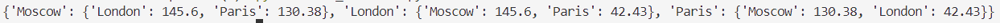

## Задание 1
Все формулы круга смотрела в интернете и вычисляла.
## Результаты вычислений
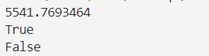

## Задание 2
Вычисление примера.
## Результаты вычислений
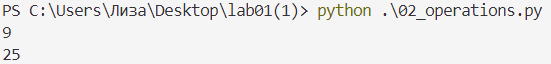

## Задание 3
Работа с фильмами с помощью срезов.
## Результаты вычислений
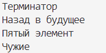 

## Задание 4
Моя семья. Я ввела рост родителям, для удобства вычисления роста всей семьи ввела переменную s.
## Результаты вычислений
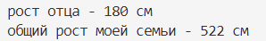
## Задание 5
Зоопарк. Команда .insert - для добавления в список 
.extend - для добавления в конец списка
remove - удаление из списка 
index - для вычисления индекса
## Результаты вычислений
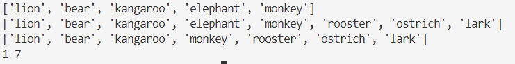
## Задание 6
Песни. В первом списке брала песни по номерам, во втором по названиям. Переменные x,y ввела для удобства подсчета минут. Использовала функцию round(переменная, до скольки чисел округлить)
## Результаты вычислений
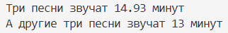
## Задание 7
Секретное послание. Просто работа с срезами, делала срезы по представленной ссылке.
## Результаты вычислений
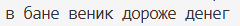
## Задание 8
Сад. Нашла статью по работе с множествами и сделала.
## Результаты вычислений
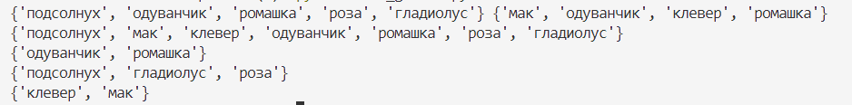
## Задание 9
Шопинг. Создала список со сладостями с 2-мя магазинами с минимальными ценами.
## Результаты вычислений
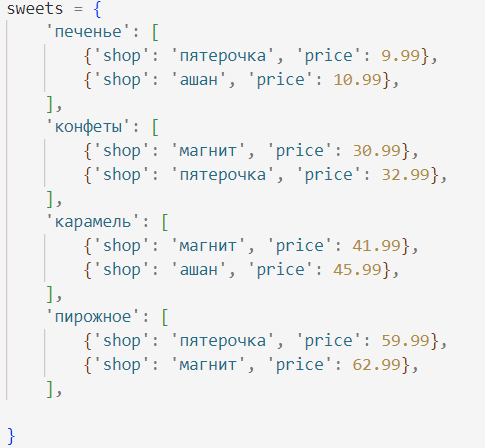
## Задание 10
Магазин. Самое объемное задание, в переменных чтобы полностью не писать диван и стул сократила их до первой буквы. У разных штук мебели разная цена, поэтому везде считала все по отдельности,умножала:(
## Результаты вычислений
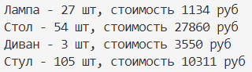

## Шпаргалка по работе с git:
git clone - для клонирования существующего репозитория Git.
git add - добавляет содержимое рабочей директории в индекс для последующего коммита.
git commit -m "" - позволяет добавить однострочное сообщение при создании коммита в репозитории. 
git push - это консольная команда, которая передаёт в удалённый репозиторий изменения, сделанные в локальном репозитории.
## Использованные источники:
1. [Подробная информация об обратных срезах](https://clck.ru/MfEMS)
2. [Статья о работе с множествами](https://skillbox.ru/media/code/mnozhestva-v-python-vvodnyy-gayd-dlya-nachinayushchikh/)

