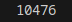
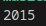
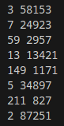

# Лабораторная работа №2
# Вариант 1
## Задание 1
Тимофей составляет 5-буквенные коды из букв Т, И, М, О, Ф, Е, Й. Буква Й может использоваться в коде не более одного раза, при этом она не может стоять на первом месте, на последнем месте и рядом с буквой И. Все остальные буквы могут встречаться произвольное количество раз или не встречаться совсем. Сколько различных кодов может составить Тимофей?
В модуле itertools использовала функцию product для слов с повторяющимися буквами, поставила условия для того, чтобы "й" не была первой и последней, так же чтобы отсутствовали сочетания "ий" "йи". 
## Результаты вычислений

## Задание 2
Сколько единиц содержится в двоичной записи значения выражения $4^{2020}+2^{2017}-15$ ?
Переменная х для примера, s для счета. while - цикл пока, % - остаток от деления, // - целочисленное деление, [::-1] - срез с шагом -1
## Результаты вычислений

## Задание 3
Найдите среди целых чисел, принадлежащих числовому отрезку [174457;174505], числа, имеющие ровно два различных натуральных делителя, не считая единицы и самого числа. Для каждого найденного числа запишите эти два делителя в два соседних столбца на экране с новой строки в порядке возрастания произведения этих двух делителей. Делители в строке также должны следовать в порядке возрастания. 
В первой строчке к числу 174505 сразу добавила 1. В цикле начинала с 2 при нахождении 2-ух делителей заканчивала.
## Результаты вычислений

## Список использованных источников:
1. [Itertools в Python](https://habr.com/ru/companies/otus/articles/529356/)
2. [Итерируем правильно: 20 приемов использования в Python модуля itertools](https://proglib.io/p/iteriruemsya-pravilno-20-priemov-ispolzovaniya-v-python-modulya-itertools-2020-01-03)

