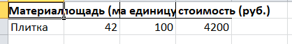

# Лабораторная работа №6
## Задание:
Отделочные материалы:
• Обои
• Плитка
• Ламинат
Расчёт количества и стоимости для закупки материалов в зависимости от площади.

## Описание проделанной работы:
Я выбрала tkinter т.к. он понятен мне больше всех.
Создала четыре файла в materials, три из них с функциями для расчета материалов, четвертая init для того чтобы файлы распознавались как пакет. 
В main функция init содержит в основном визуальные команды - размещение кнопок, текста и их цвета.
calculate - это всплывающее окошко после выбора материала с стоимостью и кол-вом.
save_report - для сохранения.
Сохранить результат можно в формате .xlsx, делала по туториалу в интернете.

## Результаты:
#### Обои:

#### Плитка:

#### Ламинат:

#### Сохранение:

## Список используемых источников:
1. [Введение в Tkinter](https://habr.com/ru/articles/133337/)
2. [Руководство по Tkinter](https://metanit.com/python/tkinter/)
3. [Библиотека Tkinter в Python](https://selectel.ru/blog/tutorials/tkinter-library-in-python/)
4. [Пишем десктоп-приложение на Python с помощью Tkinter](https://skillbox.ru/media/code/pishem-desktopprilozhenie-na-python-s-pomoshchyu-tkinter/)
5. [How can I use tkinter to prompt users to save a DataFrame to an Excel file?](https://stackoverflow.com/questions/40295587/how-can-i-use-tkinter-to-prompt-users-to-save-a-dataframe-to-an-excel-file)
6. [Что такое Tkinter](https://younglinux.info/tkinter/tkinter)