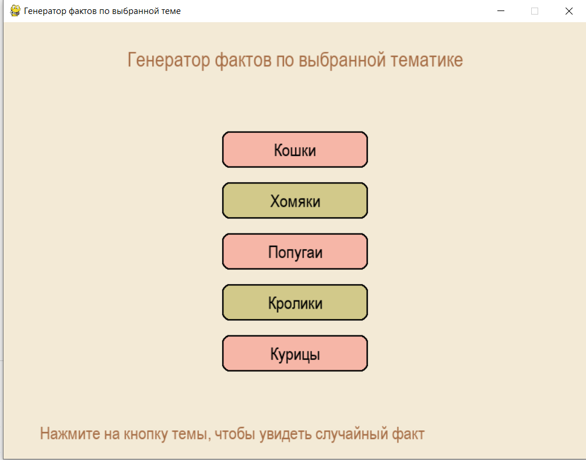
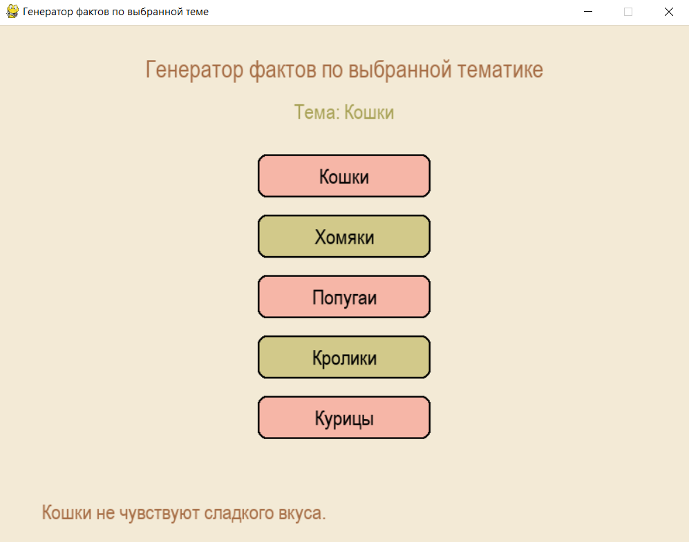

# Лабораторная работа №8
## Задание
Генератов фактов с выбором тематики. PyGame
## Описание
##### Класс FactGenerator 
get_random_fact() - возвращает случайный факт по выбранной теме или вызывает исключение
get_themes() - возвращает список доступных тем
##### Класс SimpleButton
draw() - отрисовывает кнопку на экране
is_clicked() - проверяет, была ли кнопка нажата
##### Класс FactApp
create_buttons() - создает кнопки для каждой темы
handle_events() - обрабатывает события
draw() - отрисовывает интерфейс
## Краткая справка
1. При запуске создается окно, отображаются 5 кнопок с темами и инструкция

2. При клике на кнопку:
 - Выбирается случайный факт из соответствующей темы
 - Показывается название темы

 
3. При закрытии окна программа корректно завершается
